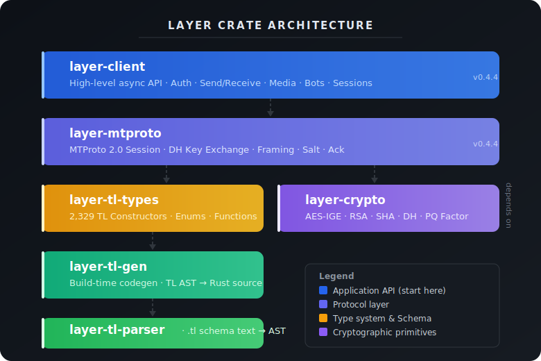
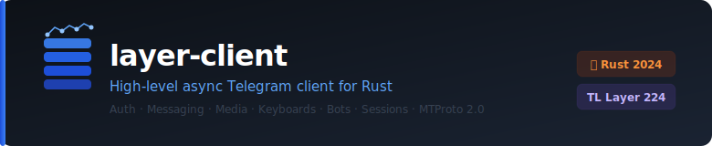
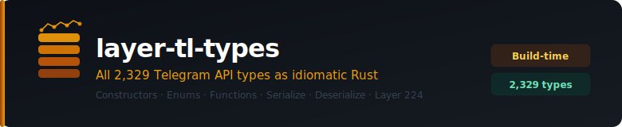
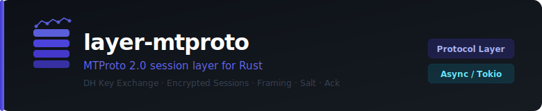
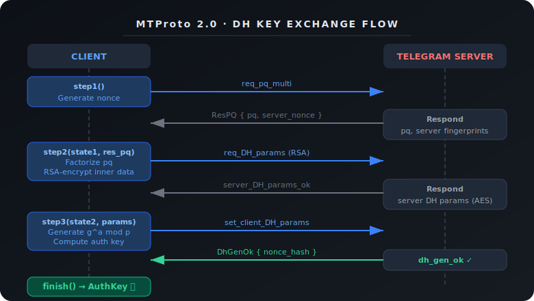
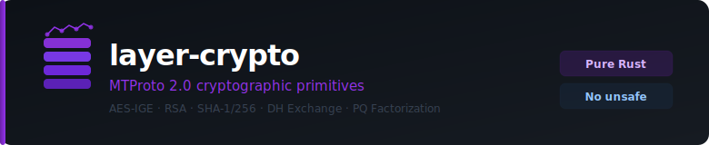
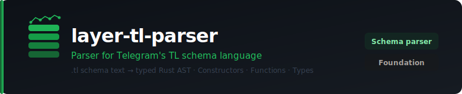
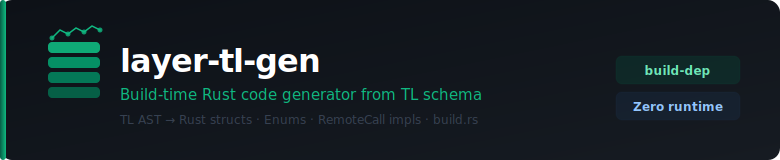

# Crate Architecture

`layer` is a workspace of focused, single-responsibility crates. Understanding the stack helps when you need to go below the high-level API.

## Dependency graph



```
Your App
  └── layer-client          ← high-level Client, UpdateStream, InputMessage
        ├── layer-mtproto   ← MTProto session, DH, message framing
        │     └── layer-crypto  ← AES-IGE, RSA, SHA, factorize
        └── layer-tl-types  ← all generated types + LAYER constant
              ├── layer-tl-gen    (build-time code generator)
              └── layer-tl-parser (build-time TL schema parser)
```

---

## layer-client



**The high-level async Telegram client.** Import this in your application.

### What it provides
- `Client` — the main handle with all high-level methods
- `ClientBuilder` — fluent builder for connecting (`Client::builder()...connect()`)
- `Config` — connection configuration
- `Update` enum — typed update events
- `InputMessage` — fluent message builder
- `parsers::parse_markdown` / `parsers::parse_html` — text → entities
- `UpdateStream` — async iterator
- `Dialog`, `DialogIter`, `MessageIter` — dialog/history access
- `Participant`, `ParticipantStatus` — member info
- `Photo`, `Document`, `Sticker`, `Downloadable` — typed media wrappers
- `UploadedFile`, `DownloadIter` — upload/download
- `TypingGuard` — auto-cancels chat action on drop
- `SearchBuilder`, `GlobalSearchBuilder` — fluent search
- `InlineKeyboard`, `ReplyKeyboard`, `Button` — keyboard builders
- `SessionBackend` trait + `BinaryFileBackend`, `InMemoryBackend`, `StringSessionBackend`, `SqliteBackend`, `LibSqlBackend`
- `Socks5Config` — proxy configuration
- `TransportKind` — Abridged, Intermediate, Obfuscated
- Error types: `InvocationError`, `RpcError`, `SignInError`, `LoginToken`, `PasswordToken`
- Retry traits: `RetryPolicy`, `AutoSleep`, `NoRetries`, `RetryContext`

---

## layer-tl-types



**All generated Telegram API types.** Auto-regenerated at `cargo build` from `tl/api.tl`.

### What it provides
- `LAYER: i32` — the current layer number (224)
- `types::*` — 1,200+ concrete structs (`types::Message`, `types::User`, etc.)
- `enums::*` — 400+ boxed type enums (`enums::Message`, `enums::Peer`, etc.)
- `functions::*` — 500+ RPC function structs implementing `RemoteCall`
- `Serializable` / `Deserializable` traits
- `Cursor` — zero-copy deserializer
- `RemoteCall` — marker trait for RPC functions
- Optional: `name_for_id(u32) -> Option<&'static str>`

### Key type conventions

| Pattern | Meaning |
|---|---|
| `tl::types::Foo` | Concrete constructor — a struct |
| `tl::enums::Bar` | Boxed type — an enum wrapping one or more `types::*` |
| `tl::functions::ns::Method` | RPC function — implements `RemoteCall` |

Most Telegram API fields use `enums::*` types because the wire format is polymorphic.

---

## layer-mtproto



**The MTProto session layer.** Handles the low-level mechanics of talking to Telegram.

### What it provides
- `EncryptedSession` — manages auth key, salt, session ID, message IDs
- `authentication::*` — complete 3-step DH key exchange
- Message framing: serialization, padding, encryption, HMAC
- `msg_container` unpacking (batched responses)
- gzip decompression of `gzip_packed` responses
- Transport abstraction (abridged, intermediate, obfuscated)

### DH handshake steps



1. **PQ factorization** — `req_pq_multi` → server sends `resPQ`
2. **Server DH params** — `req_DH_params` with encrypted key → `server_DH_params_ok`
3. **Client DH finish** — `set_client_DH_params` → `dh_gen_ok`

After step 3, both sides hold the same auth key derived from the shared DH secret.

---

## layer-crypto



**Cryptographic primitives.** Pure Rust, `#![deny(unsafe_code)]`.

| Component | Algorithm | Usage |
|---|---|---|
| `aes` | AES-256-IGE | MTProto 2.0 message encryption/decryption |
| `auth_key` | SHA-256, XOR | Auth key derivation from DH material |
| `factorize` | Pollard's rho | PQ factorization in DH step 1 |
| RSA | PKCS#1 v1.5 | Encrypting PQ proof with Telegram's public keys |
| SHA-1 | SHA-1 | Used in auth key derivation |
| SHA-256 | SHA-256 | MTProto 2.0 MAC computation |
| `obfuscated` | AES-CTR | Transport-layer obfuscation init |
| PBKDF2 | PBKDF2-SHA512 | 2FA password derivation (via layer-client) |

---

## layer-tl-parser



**TL schema parser.** Converts `.tl` text into structured `Definition` values.

### Parsed AST types
- `Definition` — a single TL line (constructor or function)
- `Category` — `Type` or `Function`
- `Parameter` — a named field with type
- `ParameterType` — flags, conditionals, generic, basic
- `Flag` — `flags.N?type` conditional fields

Used exclusively by `build.rs` in `layer-tl-types`. You never import it directly.

---

## layer-tl-gen



**Rust code generator.** Takes the parsed AST and emits valid Rust source files.

### Output files (written to `$OUT_DIR`)
| File | Contents |
|---|---|
| `generated_common.rs` | `pub const LAYER: i32 = N;` + optional `name_for_id` |
| `generated_types.rs` | `pub mod types { … }` — all constructor structs |
| `generated_enums.rs` | `pub mod enums { … }` — all boxed type enums |
| `generated_functions.rs` | `pub mod functions { … }` — all RPC function structs |

Each type automatically gets:
- `impl Serializable` — binary TL encoding
- `impl Deserializable` — binary TL decoding
- `impl Identifiable` — `const CONSTRUCTOR_ID: u32`
- Optional: `impl Debug`, `impl From`, `impl TryFrom`, `impl Serialize/Deserialize`
